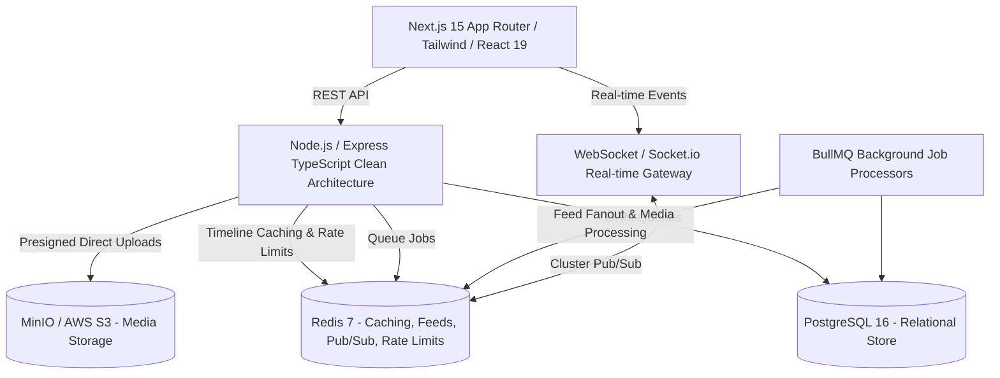

# Enterprise Social Media Platform

[](https://github.com/Rajtiwari0202/social_media_platform/actions)
[](LICENSE)
[](https://nodejs.org)
[](https://www.postgresql.org)
[](https://redis.io)

A production-grade, highly scalable social media platform engineered with enterprise patterns: **TypeScript Monorepo**, **Next.js 15 App Router**, **Node.js Clean Architecture API**, **PostgreSQL 16**, **Redis 7 Caching & Pub/Sub**, **BullMQ Async Workers**, and **MinIO/S3 Direct Media Pipelines**.

---

## 🏛️ System Architecture



---

## 📁 Repository Structure

```
├── .github/workflows/         # Automated GitHub Actions CI/CD workflows
├── apps/
│   ├── api/                   # Backend REST & WebSocket API (Express + TypeScript + Prisma)
│   │   ├── prisma/            # Database schema & migration files
│   │   └── src/               # Clean architecture modules (controllers, services, repositories)
│   └── web/                   # Frontend Web Application (Next.js 15, React 19, Tailwind)
│       └── src/               # App Router pages, components, hooks, and TanStack queries
├── packages/
│   └── shared/                # Shared TypeScript types, DTOs, and Zod validation schemas
├── docs/                      # Enterprise documentation & Architecture Decision Records (ADRs)
│   ├── SYSTEM_DESIGN.md       # High-level architecture, caching, fan-out & security
│   ├── DATA_MODEL.md          # Entity-Relationship diagram and table definitions
│   ├── API_SPECIFICATION.md   # REST API endpoint contracts and RFC 7807 error formats
│   └── adr/                   # Architecture Decision Records
├── docker-compose.yml         # Local containerized infrastructure (Postgres, Redis, MinIO, MailHog)
├── .env.example               # Environment variables template
└── package.json               # Root monorepo workspace configuration
```

---

## 🚀 Quick Start Guide

### Prerequisites
- **Node.js** `>= 22.0.0`
- **npm** `>= 10.0.0`
- **Docker & Docker Compose**

### 1. Clone & Configure Environment
```bash
git clone https://github.com/Rajtiwari0202/social_media_platform.git
cd social_media_platform
cp .env.example .env
```

### 2. Start Local Infrastructure
Launch PostgreSQL, Redis, MinIO, and MailHog in Docker:
```bash
npm run docker:up
```

Verify running containers:
```bash
npm run docker:ps
```

| Service | Port | Local URL / Console |
| :--- | :--- | :--- |
| **API Backend** | `5000` | `http://localhost:5000/api/v1` |
| **Web Frontend** | `3000` | `http://localhost:3000` |
| **PostgreSQL** | `5432` | `localhost:5432` (db: `social_platform_dev`) |
| **Redis** | `6379` | `localhost:6379` |
| **MinIO Console** | `9001` | `http://localhost:9001` (`minioadmin` / `minioadminpassword`) |
| **MailHog Inbox** | `8025` | `http://localhost:8025` |

### 3. Install Dependencies & Generate Database Client
```bash
npm install
npm run prisma:generate
```

### 4. Run Development Servers
```bash
npm run dev
```

---

## 🗺️ Corporate Phased Roadmap

- [x] **Phase 0: Foundation, Architecture & Repository Setup**
  - [x] Monorepo workspace configuration
  - [x] Dockerized local infrastructure (Postgres 16, Redis 7, MinIO, MailHog)
  - [x] Architecture blueprints, ADRs, Data Models, and API contracts
  - [x] GitHub Actions CI pipeline & Git remote sync
- [ ] **Phase 1: Identity, Auth & User Profile Subsystem**
  - [ ] Argon2id password hashing, Access/Refresh Token rotation (HTTP-only cookies)
  - [ ] Session revocation & Redis auth rate limiting
  - [ ] Profile management (avatars, bio, handle validation)
- [ ] **Phase 2: Social Graph, Follower System & Activity Matrix**
  - [ ] Bi-directional follow/unfollow engine
  - [ ] Block/Mute mechanics
  - [ ] Cursor-based follower lists
- [ ] **Phase 3: Content Creation, Media Engine & Interactivity**
  - [ ] Rich text & Markdown posts
  - [ ] Direct-to-MinIO/S3 media upload pipeline
  - [ ] Nested threaded comments
  - [ ] Likes, bookmarks, reposts/quotes
- [ ] **Phase 4: High-Scale Hybrid Feed Engine & Caching Layer**
  - [ ] Hybrid Fan-out on write / Fan-out on read
  - [ ] Redis timeline cache and ranking algorithms
- [ ] **Phase 5: Real-Time Communication & Notifications**
  - [ ] WebSocket gateway with Redis pub/sub
  - [ ] Live notification dispatch
  - [ ] 1-on-1 direct messaging with read receipts
- [ ] **Phase 6: Search, Discovery, Analytics & Production Hardening**
  - [ ] PostgreSQL full-text search (GIN indexes)
  - [ ] Trending hashtags algorithm
  - [ ] Prometheus metrics, rate limiting & security hardening

---

## 📜 License
Distributed under the MIT License.
