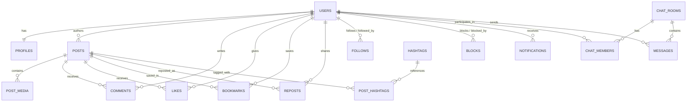

# Production-Grade Social Media Platform: Data Model & Schema Specification

## 1. Entity-Relationship (ER) Overview

---

## 2. Table Schemas & Definitions

### 2.1 `users` Table (Identity & Security)
| Column | Type | Constraints | Description |
| :--- | :--- | :--- | :--- |
| `id` | `UUID` | `PRIMARY KEY`, Default `gen_random_uuid()` | Unique immutable user ID |
| `email` | `VARCHAR(255)` | `UNIQUE`, `NOT NULL` | Normalized lowercase email address |
| `username` | `VARCHAR(32)` | `UNIQUE`, `NOT NULL` | User handle (e.g. `@raj_tiwari`) |
| `password_hash` | `VARCHAR(255)` | `NOT NULL` | Argon2id password hash |
| `is_verified` | `BOOLEAN` | `DEFAULT FALSE` | Email verification status |
| `is_private` | `BOOLEAN` | `DEFAULT FALSE` | Private account flag (requires follow approval) |
| `role` | `ENUM` | `DEFAULT 'USER'`, Values: `USER`, `MODERATOR`, `ADMIN` | Role-based authorization level |
| `token_version` | `INTEGER` | `DEFAULT 0` | Incrementing counter for bulk session revocation |
| `created_at` | `TIMESTAMPTZ` | `DEFAULT CURRENT_TIMESTAMP` | Timestamp of account registration |
| `updated_at` | `TIMESTAMPTZ` | `DEFAULT CURRENT_TIMESTAMP` | Last profile/account update |
| `deleted_at` | `TIMESTAMPTZ` | `NULLABLE` | Soft deletion timestamp |

*Indexes:*
- `CREATE UNIQUE INDEX idx_users_email ON users(email) WHERE deleted_at IS NULL;`
- `CREATE UNIQUE INDEX idx_users_username ON users(username) WHERE deleted_at IS NULL;`

---

### 2.2 `profiles` Table (Public & Bio Information)
| Column | Type | Constraints | Description |
| :--- | :--- | :--- | :--- |
| `id` | `UUID` | `PRIMARY KEY`, Default `gen_random_uuid()` | Profile record ID |
| `user_id` | `UUID` | `UNIQUE`, `FOREIGN KEY REFERENCES users(id) ON DELETE CASCADE` | 1-to-1 link to user |
| `display_name` | `VARCHAR(64)` | `NOT NULL` | Display name (e.g. "Raj Tiwari") |
| `bio` | `VARCHAR(300)` | `NULLABLE` | Short personal description / bio |
| `avatar_url` | `VARCHAR(512)` | `NULLABLE` | URL of profile picture (S3/MinIO) |
| `banner_url` | `VARCHAR(512)` | `NULLABLE` | URL of profile header banner |
| `location` | `VARCHAR(100)` | `NULLABLE` | Geographical location text |
| `website` | `VARCHAR(255)` | `NULLABLE` | Personal/portfolio website URL |
| `followers_count`| `INTEGER` | `DEFAULT 0` | Cached follower counter (atomic sync) |
| `following_count`| `INTEGER` | `DEFAULT 0` | Cached following counter |
| `posts_count` | `INTEGER` | `DEFAULT 0` | Total posts published counter |
| `created_at` | `TIMESTAMPTZ` | `DEFAULT CURRENT_TIMESTAMP` | Creation timestamp |
| `updated_at` | `TIMESTAMPTZ` | `DEFAULT CURRENT_TIMESTAMP` | Update timestamp |

---

### 2.3 `follows` Table (Social Graph Relationships)
| Column | Type | Constraints | Description |
| :--- | :--- | :--- | :--- |
| `follower_id` | `UUID` | `FOREIGN KEY REFERENCES users(id) ON DELETE CASCADE` | User who initiated follow |
| `following_id`| `UUID` | `FOREIGN KEY REFERENCES users(id) ON DELETE CASCADE` | Target user being followed |
| `created_at` | `TIMESTAMPTZ` | `DEFAULT CURRENT_TIMESTAMP` | Timestamp follow was created |

*Indexes & Primary Key:*
- `PRIMARY KEY (follower_id, following_id)`
- `CREATE INDEX idx_follows_following_id ON follows(following_id, created_at DESC);`
- `CREATE INDEX idx_follows_follower_id ON follows(follower_id, created_at DESC);`

---

### 2.4 `posts` Table (Core Content Feed)
| Column | Type | Constraints | Description |
| :--- | :--- | :--- | :--- |
| `id` | `UUID` | `PRIMARY KEY`, Default `gen_random_uuid()` | Post unique identifier |
| `author_id` | `UUID` | `FOREIGN KEY REFERENCES users(id) ON DELETE CASCADE` | Creator of the post |
| `content` | `TEXT` | `NOT NULL` | Post body content (supports markdown & UTF-8) |
| `reply_to_id` | `UUID` | `NULLABLE`, `FOREIGN KEY REFERENCES posts(id) ON DELETE SET NULL` | Parent post if this is a reply thread |
| `repost_of_id` | `UUID` | `NULLABLE`, `FOREIGN KEY REFERENCES posts(id) ON DELETE SET NULL` | Original post if this is a quote/repost |
| `likes_count` | `INTEGER` | `DEFAULT 0` | Atomic counter of likes |
| `comments_count`| `INTEGER`| `DEFAULT 0` | Atomic counter of replies |
| `reposts_count` | `INTEGER`| `DEFAULT 0` | Atomic counter of reposts |
| `bookmarks_count`| `INTEGER`| `DEFAULT 0`| Atomic counter of bookmarks |
| `created_at` | `TIMESTAMPTZ` | `DEFAULT CURRENT_TIMESTAMP` | Published timestamp |
| `updated_at` | `TIMESTAMPTZ` | `DEFAULT CURRENT_TIMESTAMP` | Edited timestamp |
| `deleted_at` | `TIMESTAMPTZ` | `NULLABLE` | Soft deletion timestamp |

*Indexes:*
- `CREATE INDEX idx_posts_author_created ON posts(author_id, created_at DESC) WHERE deleted_at IS NULL;`
- `CREATE INDEX idx_posts_created_at ON posts(created_at DESC) WHERE deleted_at IS NULL;`
- `CREATE INDEX idx_posts_reply_to_id ON posts(reply_to_id) WHERE reply_to_id IS NOT NULL;`

---

### 2.5 `post_media` Table (Multi-Image / Video Attachments)
| Column | Type | Constraints | Description |
| :--- | :--- | :--- | :--- |
| `id` | `UUID` | `PRIMARY KEY`, Default `gen_random_uuid()` | Media record ID |
| `post_id` | `UUID` | `FOREIGN KEY REFERENCES posts(id) ON DELETE CASCADE` | Associated post |
| `media_url` | `VARCHAR(512)` | `NOT NULL` | Publicly accessible S3/MinIO media URL |
| `thumbnail_url`| `VARCHAR(512)` | `NULLABLE` | Optimized small thumbnail URL |
| `media_type` | `ENUM` | `Values: 'IMAGE', 'VIDEO', 'GIF'` | Attachment type |
| `file_size` | `INTEGER` | `NOT NULL` | Size in bytes |
| `width` | `INTEGER` | `NULLABLE` | Image/video pixel width |
| `height` | `INTEGER` | `NULLABLE` | Image/video pixel height |
| `order_index` | `SMALLINT` | `DEFAULT 0` | Display order in carousel/gallery |
| `created_at` | `TIMESTAMPTZ` | `DEFAULT CURRENT_TIMESTAMP` | Upload timestamp |

---

### 2.6 `comments` Table (Nested Discussion Trees)
| Column | Type | Constraints | Description |
| :--- | :--- | :--- | :--- |
| `id` | `UUID` | `PRIMARY KEY`, Default `gen_random_uuid()` | Comment ID |
| `post_id` | `UUID` | `FOREIGN KEY REFERENCES posts(id) ON DELETE CASCADE` | Post being commented on |
| `author_id` | `UUID` | `FOREIGN KEY REFERENCES users(id) ON DELETE CASCADE` | Comment author |
| `parent_id` | `UUID` | `NULLABLE`, `FOREIGN KEY REFERENCES comments(id) ON DELETE CASCADE` | Parent comment for nested threads |
| `content` | `TEXT` | `NOT NULL` | Comment body |
| `likes_count` | `INTEGER` | `DEFAULT 0` | Likes counter |
| `created_at` | `TIMESTAMPTZ` | `DEFAULT CURRENT_TIMESTAMP` | Timestamp created |
| `updated_at` | `TIMESTAMPTZ` | `DEFAULT CURRENT_TIMESTAMP` | Timestamp updated |
| `deleted_at` | `TIMESTAMPTZ` | `NULLABLE` | Soft delete timestamp |

*Indexes:*
- `CREATE INDEX idx_comments_post_created ON comments(post_id, created_at ASC) WHERE deleted_at IS NULL;`
- `CREATE INDEX idx_comments_parent_id ON comments(parent_id) WHERE parent_id IS NOT NULL;`

---

### 2.7 `likes` & `bookmarks` Tables (User Engagements)
| Column | Type | Constraints | Description |
| :--- | :--- | :--- | :--- |
| `user_id` | `UUID` | `FOREIGN KEY REFERENCES users(id) ON DELETE CASCADE` | User who liked/saved |
| `post_id` | `UUID` | `FOREIGN KEY REFERENCES posts(id) ON DELETE CASCADE` | Post liked/saved |
| `created_at` | `TIMESTAMPTZ` | `DEFAULT CURRENT_TIMESTAMP` | Timestamp of action |

*Primary Key:* `PRIMARY KEY (user_id, post_id)`

---

### 2.8 `notifications` Table (Activity Inbox)
| Column | Type | Constraints | Description |
| :--- | :--- | :--- | :--- |
| `id` | `UUID` | `PRIMARY KEY`, Default `gen_random_uuid()` | Notification ID |
| `recipient_id`| `UUID` | `FOREIGN KEY REFERENCES users(id) ON DELETE CASCADE` | Receiver of notification |
| `sender_id` | `UUID` | `FOREIGN KEY REFERENCES users(id) ON DELETE CASCADE` | Actor who triggered event |
| `type` | `ENUM` | `Values: 'LIKE', 'COMMENT', 'FOLLOW', 'MENTION', 'REPOST'` | Event classification |
| `entity_id` | `UUID` | `NULLABLE` | Linked post/comment ID |
| `is_read` | `BOOLEAN` | `DEFAULT FALSE` | Read status |
| `created_at` | `TIMESTAMPTZ` | `DEFAULT CURRENT_TIMESTAMP` | Created timestamp |

*Indexes:*
- `CREATE INDEX idx_notifications_recipient ON notifications(recipient_id, is_read, created_at DESC);`

---

### 2.9 `chat_rooms`, `chat_members`, `messages` (Real-Time Messaging)
- **`chat_rooms`**: `id`, `type ('DIRECT' | 'GROUP')`, `name`, `created_at`, `updated_at`.
- **`chat_members`**: `room_id`, `user_id`, `joined_at`, `last_read_at`. Primary Key: `(room_id, user_id)`.
- **`messages`**: `id`, `room_id`, `sender_id`, `content`, `media_url`, `created_at`, `deleted_at`.
  - Index: `CREATE INDEX idx_messages_room_created ON messages(room_id, created_at DESC);`
