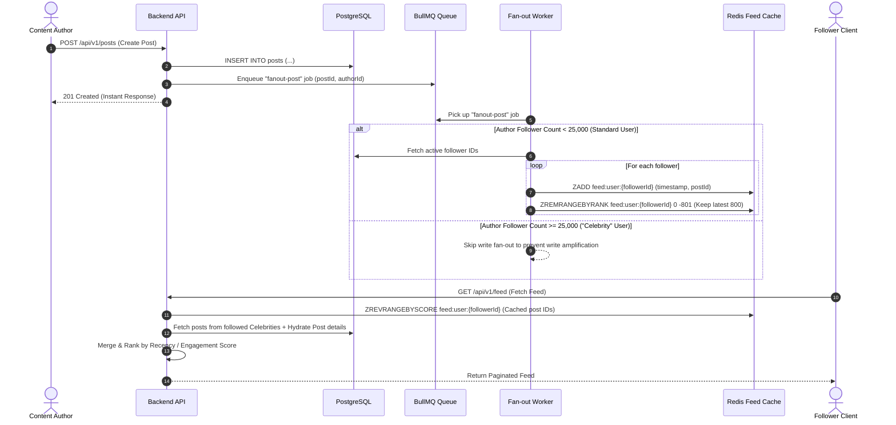
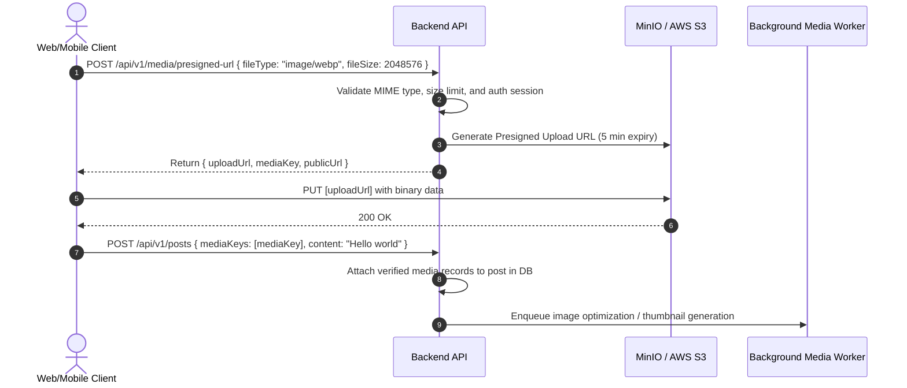

# Production-Grade Social Media Platform: System Design Document

## 1. Executive Overview
This document outlines the end-to-end software architecture, data lifecycle, caching mechanisms, feed distribution strategies, and real-time communication protocols for our production-grade social media platform.

The system is designed with high availability, low read latencies (< 50ms for feeds), transactional consistency for relationships & reactions, and horizontal scalability in mind.

---

## 2. High-Level Architecture Diagram

```mermaid
flowchart TB
    subgraph Client Layer
        Web["Next.js 15 Web Application\n(React 19, Tailwind, TanStack Query)"]
        Mobile["Mobile Clients / Future Apps\n(React Native / Flutter)"]
    end

    subgraph Edge & Ingress
        LB["Load Balancer / Reverse Proxy\n(Nginx / Cloudflare / Traefik)"]
    end

    subgraph Service Tier
        API["REST API Service Instances\n(Express / TypeScript Clean Architecture)"]
        WS["WebSocket Realtime Gateway\n(Socket.io / Redis Adapter)"]
        Worker["Background Job Processors\n(BullMQ Workers)"]
    end

    subgraph Data & Storage Tier
        PG[("PostgreSQL 16\n(Primary Relational Store)")]
        Redis[("Redis 7 In-Memory Cache\n(Feed Lists, Sessions, Rate Limits, PubSub)")]
        S3[("MinIO / AWS S3\n(Object Storage for Media)")]
        Mail[("SMTP Mail Service\n(MailHog / Resend / SendGrid)")]
    end

    Client Layer -->|HTTPS / REST & WSS| LB
    LB -->|Load Balanced Traffic| API
    LB -->|WebSocket Connections| WS

    API -->|Read / Write Relational Queries| PG
    API -->|Feed Cache / Rate Limiting / Session Invalidation| Redis
    API -->|Direct Presigned URLs (Upload/Download)| S3
    API -->|Enqueue Async Jobs| Redis

    Worker -->|Consume Queued Jobs| Redis
    Worker -->|Feed Timeline Fan-out| Redis
    Worker -->|Relational Data Sync| PG
    Worker -->|Send Emails / Push Notifications| Mail

    WS <-->|Cluster-wide Event Pub/Sub| Redis
    WS -->|Validate Session / Token| Redis
```

---

## 3. Core Architectural Subsystems

### 3.1 Authentication & Session Management
- **Token Architecture**:
  - **Access Token**: Short-lived JWT (15 minutes lifespan) containing `userId`, `role`, and token version (`tokenVersion`). Transmitted via `Authorization: Bearer <token>` or `HttpOnly` Secure Cookie.
  - **Refresh Token**: Long-lived opaque cryptographic token (7 days lifespan) stored hashed in PostgreSQL (`refresh_tokens` table) and set in an `HttpOnly`, `SameSite=Strict`, `Secure` cookie.
  - **Token Rotation**: Each refresh request invalidates the previous refresh token and issues a new pair.
  - **Immediate Revocation**: User password change or logout invalidates all active sessions by incrementing the user's `tokenVersion` stored in Redis/Postgres.
- **Password Security**: Passwords are encrypted using **Argon2id** (memory-hard, resistant to GPU/ASIC cracking).

### 3.2 Social Graph & Relationship Engine
- **Follower Model**: Unidirectional edge in the `follows` table (`follower_id`, `following_id`, `created_at`).
- **High-Performance Querying**:
  - Indexing: Composite primary key `(follower_id, following_id)` and reverse composite index `(following_id, follower_id)`.
  - Fast follower/following counts cached atomically in Redis (`user:{id}:stats` hash) and synchronized with PostgreSQL.
- **Privacy Controls**: Direct exclusion of blocked users from search, feed queries, and direct message attempts.

### 3.3 Hybrid Feed Fan-Out Architecture (Mitigating the "Celebrity Problem")



- **Fan-Out on Write (Push Model)**:
  - When users with $< 25,000$ followers post, an asynchronous BullMQ worker pushes the `postId` into the Redis timeline sorted set (`ZADD feed:user:{followerId}`) of all their active followers.
  - Read latency for followers: $\mathcal{O}(k)$ where $k$ is page size (extremely fast).
- **Fan-Out on Read (Pull Model)**:
  - For high-profile accounts ($> 25,000$ followers), pushing to millions of Redis sets creates severe write amplification.
  - Instead, celebrity posts are merged at read time from PostgreSQL/Redis caches into the user's feed stream.

### 3.4 Direct-to-Storage Media Pipeline (Presigned S3/MinIO URLs)



- Prevents binary media traffic from saturating backend web servers.
- Backend verifies image dimensions, MIME signatures, and invokes Sharp for thumbnail/WebP optimization.

### 3.5 Real-Time Communication & Presence
- **Socket.io + Redis Pub/Sub**: Enables horizontal scaling across multiple Node.js server pods.
- **Direct Messaging**:
  - 1-on-1 and Group rooms.
  - End-to-end read receipts (`delivered_at`, `read_at`).
  - Ephemeral typing indicators (`chat:typing:{roomId}`).
- **Live Notifications**:
  - Dispatched via WebSocket if recipient is connected online.
  - Stored in PostgreSQL `notifications` table for unread notification inbox retrieval.

---

## 4. Security & Compliance Strategy
1. **Input Sanitization & Schema Validation**:
   - All REST request bodies, query params, and route parameters are strictly validated using **Zod** before hitting controllers.
2. **Rate Limiting**:
   - Token Bucket algorithm backed by Redis (`express-rate-limit` / `ioredis`).
   - Strict limits on authentication endpoints (e.g. 5 attempts / 15 minutes for login).
3. **HTTP Security Headers**:
   - Configured via **Helmet**: Content Security Policy (CSP), Strict-Transport-Security (HSTS), X-Frame-Options (DENY), X-Content-Type-Options (nosniff).
4. **CORS Policy**:
   - Explicit whitelist of trusted frontend origins.

---

## 5. Performance & Scalability Targets
- **Feed API Read Latency**: $< 50\text{ms}$ (p95)
- **Post Creation Response**: $< 100\text{ms}$ (p95)
- **Concurrent WebSocket Connections**: $10,000+$ per node
- **Database Query Latency**: $< 10\text{ms}$ for indexed lookups
